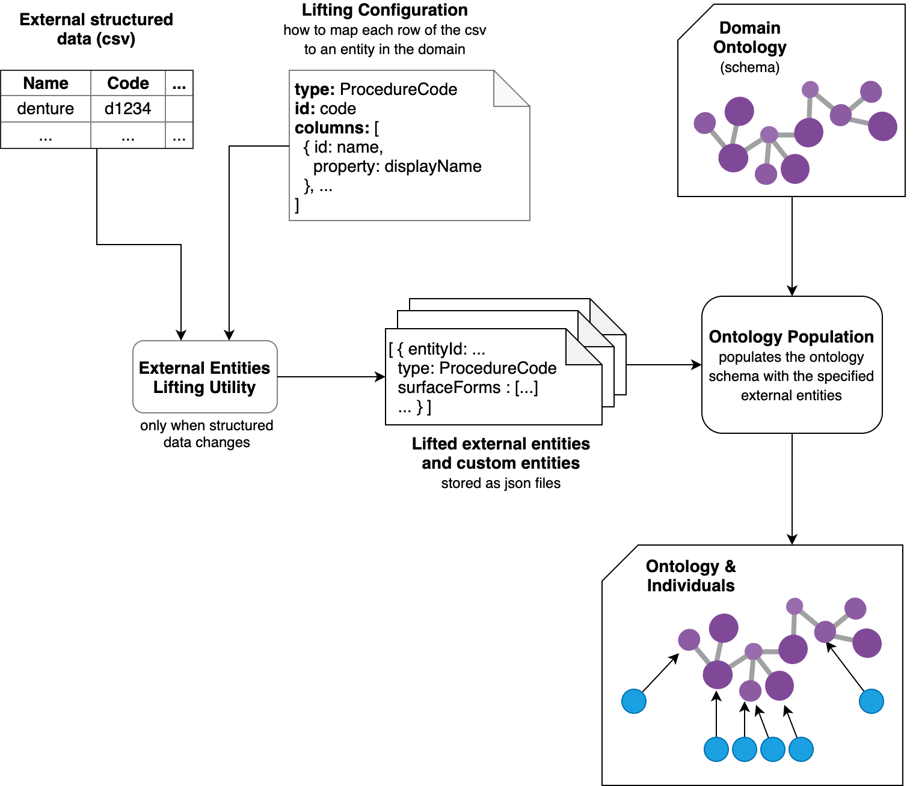

# External Entities and Lifting Utility 

This document will describe the meaning and usage of _external entities_ and the utility that is used to load structured data as external entities

1. [Overview](#overview)
   1. [What is an external entity](#what-is-an-external-entity)
   2. [Entity groups](#group-entities)
   3. [Merging entities](#merge-information-split-in-multiple-files)
2. [The lifting utility](#the-lifting-utility)
3. [Common tasks](#common-tasks)
    1. [Add a new custom group](#add-a-custom-group)
    2. [Edit an existing custom group](#edit-an-existing-custom-group)
    3. [Add entities and groups for a new domain](#add-entities-and-groups-for-a-new-domain)

## Overview
### What is an external entity? 

Each domain (such as dental, supplies, physical therapy) require different entities to be loaded into the ontology at application startup time, so they can be used in policy knowledge extraction.  The term **external entities** is used to refer to all entities (individuals) that can be loaded as part of the ontology, if needed. 

All external entities are stored under `src/main/resources/external-entities/` in json format. An example of external entity is the following:

```json
  {
    "entityId": "http://claims-audit.ibm.com/procedure_code_d5720",
    "description": null,
    "displayName": "d5720 - rebase maxillary partial denture",
    "surfaceForms": [
      "dentures rebase part maxill",
      "rebase maxillary partial denture",
      "d5720"
    ],
    "tag": "procedure-codes-dental.20190718",
    "claimValue": "D5720",
    "timestamp": "2019-10-31T10:38:48.814236Z",
    "entityTypeIds": [
      "http://claims-audit.ibm.com/ProcedureCode"
    ],
    "type": "INDIVIDUAL"
  }
```

The main properties of an external entity are: 

* **entityId**, it will become the individual id; it **must** be unique, if two external entities' description have the same id the system will try to merge the information into one single entity (see section below).
* **displayName**, loaded as `:displayName` annotation in the ontology  
* **surfaceForms**, loaded as `:label` annotations in the ontology
* **claimValue**, loaded as `:claimValue` annotation in the ontology
* **entityTypeIds**, the types (one or more) of the individual in the ontology
* **type**, the type of the entity: it can be `INDIVIDUAL` or `GROUP`, both will be loaded in the ontology as individuals, but groups may contain a list of group members (that are single individuals). See below for an example of a group entity.

#### Group entities 

`GROUP` external entities are used to define concepts that represent groups of resources (listed as members), for example

```json
{
    "entityId": "http://claims-audit.ibm.com/custom_procedure_codes_group_fixed_space_maintainer_placement",
    "comment": "'D1510', 'D1516', 'D1517'",
    "type": "GROUP",
    "displayName": "fixed space maintainer",
    "members": [
      {
        "id": "http://claims-audit.ibm.com/procedure_code_d1510",
        "type": "SINGLE"
      },
      {
        "id": "http://claims-audit.ibm.com/procedure_code_d1516",
        "type": "SINGLE"
      },
      {
        "id": "http://claims-audit.ibm.com/procedure_code_d1517",
        "type": "SINGLE"
      }
    ]
  }
``` 

Each `member` in the `members` array has the form of a `CandidateValue` (**to be fixed**: it should not reuse the concept of `CandidateValue`).

#### Custom groups
Custom groups, for example, service categories, may be defined and added to the groups json files for use by the lifting service. These groups may contain individual entities and ranges of entities, which are processed and  treated as very large group of procedure codes. [How to add a group](#add-a-custom-group)

##### Merge information split in multiple files 

We said that `entityId` values **must** identify uniquely an external entities. 
If the same `entityId` is associated to multiple json elements in the same file or in multiple files, the system will try to merge the information to build a unique external entities. 
If the information can not be merged, the load will fail. 

For example, given the group above and the following additional json entity: 

```json
{
    "id": null,
    "entityId": "http://claims-audit.ibm.com/custom_procedure_codes_group_fixed_space_maintainer_placement",
    "description": null,
    "displayName": "fixed space maintainer placement",
    "surfaceForms": [
      "fixed space maintainer placement"
    ],
    "tag": "28/10/2019",
    "timestamp": "2019-10-28T10:58:09.337Z",
    "entityTypeIds": [
      "http://claims-audit.ibm.com/CustomProcedureCodesGroup"
    ],
    "type": "GROUP"
  }
```

the merge would fail, because of the duplicated `displayName` property.


### The lifting utility

The purpose of this utility is to lift external data from a csv file into
the internal format used by the service. 

Each column in the csv can be configured to: 

1. generate an individual entity  
2. be used as a range value for other entitie's properties 


The following diagram represents both the lifting process and the loading of external entities in the ontology.



#### Generate a json file containing the entities 

Prerequisites for the csv file:

* should contain unique headers
* should contain all and only the rows that need to be processed and loaded in the output model
* can contain additional columns that will be ignored
* should be a well-formed comma separated values file, i.e. values should be property quoted and escaped

Steps:

1. Set up the lifting configuration...see below!

2. Hit the endpoint `/external-data/lift` to generate the json representation of the lifted entities

3. (optional) Save the generated entities in the appropriate location


#### Set up the lifting configuration 

An example of configuration file can be found [sample configuration](samples/sample-lifting-configuration.json)
where:

* `namespace` is the namespace to use when creating new individuals in the output model
* `columns` is an array of column configurations,
each column in this array will be transformed in an individual in the output model;
for each column is specified
    * `column`, the name of the column in the csv
    * `type`, the class type in the output model for which a new individual has to be created
    * `properties`, an array of property's definitions that will be associated with the created individual in the output model
        * `property`, defines the target property to use, there are two types of properties:
            * (a) predefined properties, currently `DISPLAY_NAME`, `SURFACE_FORM`, `DESCRIPTION` and `CLAIM_VALUE` values are supported
            * (b) custom defined properties, **not yet implemented!**, that are defined by  
                * `uri`, the property uri
                * `type`, the type of the range value, currently `LITERAL` and `INDIVIDUAL` value are allowed
                * `typeUri`, the uri of the type for the range value         
        * `columns`, a list of column names in the csv that contain the desired range values. Multiple values are supported only for `string` datatype properties.
        * `formatter`, the formatting string used to combine the `columns` in case of multiple values;
        by default is a dash-separated string. It supports the [Java Formatter syntax](https://docs.oracle.com/javase/8/docs/api/java/util/Formatter.html#syntax).
        * `transformation`, the case transformation to apply to each one of the column values before using them as arguments of the `range_value_formatter`.
        Supported values are: `UPPERCASE`, `LOWERCASE`, `SWAPCASE`, `CAPITALIZE`, `UNCAPITALIZE`, as described [here](https://commons.apache.org/proper/commons-lang/apidocs/org/apache/commons/lang3/StringUtils.html).


## Common tasks
### Add a custom group

In order to add a custom group composed of members which have already been loaded into the ontology, for example, a service category:

1) Use the API endpoint `/external-entities/process-group` with configuration detailed below to generate the necessary JSON
2) Append the json to the appropriate group-members.json file and save
3) Restart/redeploy the application

For example, to add new service category such as service_category_dental, post the configuration object  to `/external-entities/process-group`:
```
{
    "description": "Service category for all dental services",
    "displayName": "all dental services",
    "entityId": "http://claims-audit.ibm.com/service_category_dental",
    "proposedMembers": [
        {
            "groupAdditionBeginCode": "D0120",
            "groupAdditionEndCode": "D9999",
            "groupAdditionItemType": "RANGE"
        },
        {
            "groupAdditionBeginCode": "C9727",
            "groupAdditionEndCode": "",
            "groupAdditionItemType": "SINGLE_CODE"
        },
        {
            "groupAdditionBeginCode": "99188",
            "groupAdditionEndCode": "",
            "groupAdditionItemType": "SINGLE_CODE"
        }
    ],
    "namespace": "http://claims-audit.ibm.com/",
    "tag": "string",
    "typesId": [
    "http://claims-audit.ibm.com/ServiceCategory"
    ]
}
```
* **groupAdditionItemType** allowed values `SINGLE_CODE`, `RANGE`,

This outputs a json object composed of `groupAdditionEntry` (the group) and `individualExternalEntities` (the full list of entities).  Append the content of `groupAdditionEntry` to the relevant groups-members.json file in your workspace and save.

### Edit an existing custom group
The members of an existing custom group may need to be updated from time to time.
1. Navigate to src/main/resources/external-entities/ and identify the file which holds your group
2. Edit the json object with the entityId of your group and save changes
3. [Restart/redeploy](https://github.ibm.com/WH-GovHHS/GovHHS-Analytics-cca-policy-knowledge-extraction-service#useful-commands-when-inside-the-dev-container) the application

### Add entities and groups for a new domain
New domains may require different categories of procedure codes for entity creation.  

If adding a new category of codes taken from the procedures.csv file provided by the SMEs, these instructions may be used to speed up the process.

Prerequisites: install Python3, and run `pip install pandas`.
1. In order to generate a CSV containing the subset of codes from procedures.csv and a csv containing groups using the provided python script:
   1. Navigate to /external-data/procedure-codes directory and confirm that you have the up-to-date version of `procedures.csv`
   2. Run the following on the cmd line:
        ```
         ./external_data_csv_filter.py '{PROCEDURE_CODE_PATH_AND_FILE_NAME}' '{CSV_OUTPUT_PATH_AND_FILE_NAME}' '{CSV_GROUPS_OUTPUT_PATH_AND_FILE_NAME}''{CSC_CATEGORY}'
        ```
       For example, to create a new csv file with the supplies category
        ```
         ./external_data_csv_filter.py '/Users/ingevejs/Documents/workspace/WH-GovHHS/GovHHS-Analytics-cca-policy-knowledge-extraction-service/external-data/procedure-codes/procedures.csv' '/Users/ingevejs/Documents/workspace/WH-GovHHS/GovHHS-Analytics-cca-policy-knowledge-extraction-service/external-data/procedure-codes/procedures-supplies.csv'  '/Users/ingevejs/Documents/workspace/WH-GovHHS/GovHHS-Analytics-cca-policy-knowledge-extraction-service/external-data/procedures-groups/procedures-groups-proccode-supplies.csv' 'SUPPLIES'
        ```
   3. Verify the contents of the CSV files.
    
2. Use the lifting service API to prepare json for individual entities.  
   NB. The lifting service requires the csv header format and the lifting configuration to match. An example pairing of two matching files can be found in the [samples](/docs/samples) folder `/docs/samples/sample-lifting-configuration.json` and `/docs/samples/sample-procedures.csv`
    1. Hit the endpoint `/external-entities/lift` using the lifting config defined here: `/external-data/procedure-codes/lifting-configuration.json` and your new csv file.  
    2. Save the generated entities in the appropriate location.  For our example above we would create a directory and add file `/src/main/resources/external-entities/procedure-codes/supplies/individuals.json`
    3. Update the `src/main/resources/application.yaml` file to add an entry under `external-data.input.files` for your new file
    4. [Restart/redeploy application](https://github.ibm.com/WH-GovHHS/GovHHS-Analytics-cca-policy-knowledge-extraction-service#useful-commands-when-inside-the-dev-container) to use your new individual entities in the ontology
3. Adding custom groups,
   1. either
     - Use the custom group json endpoint detailed above to manually [add a new group](#add-a-custom-group)
    , or
     - use the endpoint to take multiple groups from the groups csv and create json for manual addition to the files
         1. Choose the csv file and the endpoint `/external-entities/process-group-csv` to generate the json representation of the group entities
         2. Save the generated entities in the appropriate location.  For our example above we would create a directory and add file `/src/main/resources/external-entities/procedure-codes/supplies/individuals.json`
         3. Update the `src/main/resources/application.yaml` file to add an entry under `external-data.input.files` for your new file
         4. [Restart/redeploy application](https://github.ibm.com/WH-GovHHS/GovHHS-Analytics-cca-policy-knowledge-extraction-service#useful-commands-when-inside-the-dev-container) to use your new individual entities in the ontology
   2. Save the generated entities in appropriate location.  For our example above we would create a directory and add file `/src/main/resources/external-entities/procedure-codes/supplies/group-members.json`
   3. Update the `src/main/resources/application.yaml` file to add an entry under `external-data.input.files` for your new file
   4. [Restart/redeploy](https://github.ibm.com/WH-GovHHS/GovHHS-Analytics-cca-policy-knowledge-extraction-service#useful-commands-when-inside-the-dev-container) application to use your new group entities in the ontology
