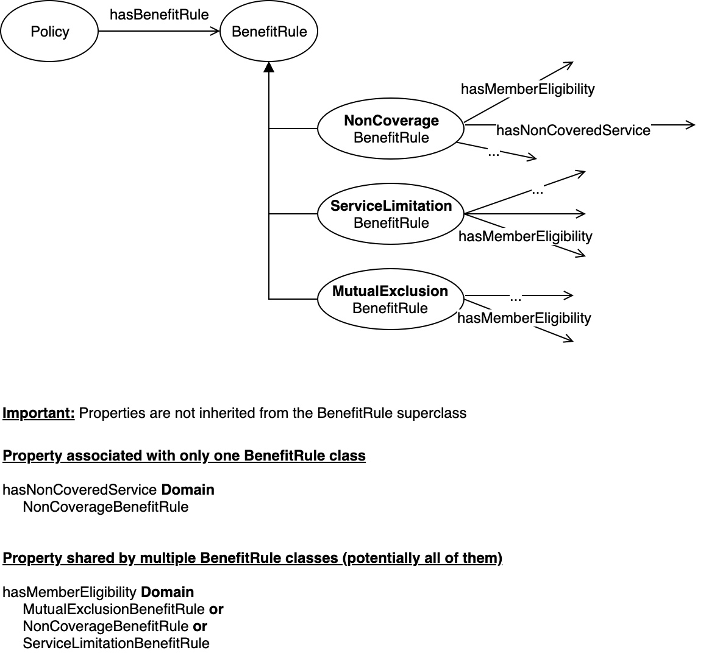
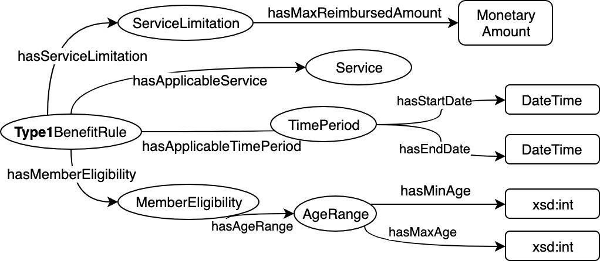

# The Domain Ontology

The domain ontology is the main source of information that guides the extraction process.

It is available in `src/main/resources/ontology/benefit-rule-ontology.ttl`. The content of this file is mainly related to the _schema_ of the ontology, with some predefined and general purpose individual. 
Most of the individuals are stored in `json` and we will refer to them as [**external entities**](../external-entities-and-lifting.md). These external entities are loaded as part of the ontology (they will become _individuals_) in the start-up phase of the service. 

#### Structure of the ontology

The base structure of this ontology currently contains:

* A `Policy` class, whose instances represent specific documents and will _collect_
all extracted benefit rules
* A `BenefitRule` class, that will be the superclass of all the available benefit rule types - you can see it as an `abstract class` in java
* One or more `<name>BenefitRule` subclasses of `BenefitRule`, one for each **rule template** that is covered in the system. 

A **Rule Template** is semantically defined by the properties that are "linked to it", i.e. the properties that have `<rule-template-class>` as part of their domain. 

For example, the `NonCoverageBenefitRule` is currently defined as the combination of the folllowing `root-properties` (see definitions below): 

```
hasNotApplicableService
hasExcludedService
hasMemberEligibility
hasPerBodyPartApplicability
hasPlaceOfService
```

Following a visual representation of the current `BenefitRule` classes hierarchy.

<br/>




Note that `root-properties` that are shared across all the `BenefitRule` classes **must** have as domain the `or` of all the classes involved, see example of `hasMemberEligibility` in the picture above. Consider also that: 

* properties are **not inherited** from the superclass `BenefitRule`; so assuming that `p` is a property that has `BenefitRule` as domain, it means that a hypothetical query `SubclassOfBenefitRule.hasDomain(p)` will always return `false`.
* The domain **must** be an `or` of `BenefitRule` subclasses, without explicitly specifying the `or` the classes are assumed to be in intersection with each other.

## Ontology files

The main ontology file is `src/main/resources/ontology/benefit-rule-ontology.ttl`. 

The ontology can be split into multiple files, that can be loaded together to build
the full graph to guide the extraction. For example, currently the ontology related to body parts is kept separate under `src/main/resources/ontology/body-parts/dental/body-parts.ttl`.


## Definitions

#### Resources interesting for extraction

Let's call **root benefit rule classes** all the subclasses of `BenefitRule`. 

Given one of the root benefit rule classes, the resources to be extracted by the system
are the one "connected" to that class, following the edges `<domain-property-range>`
and the subclass relations. Only `owl:ObjectProperty` and `owl:DatatypeProperty`
are taken into account during the extraction. 

#### Root, intermediate and leaf resources

Consider the following simplified benefit rule schema, containing the _properties interesting for extraction_ for `Type1BenefitRule` 



We can introduce some definitions: 

* **outgoing property** for a class A, a property that has A as domain, e.g. outgoing properties of `TimePeriod` are `hasStartDate` and `hasEndDate`
* **leaf node**, a class/node without outgoing properties, e.g. `MonetaryAmount`, `DateTime`, `Service`, `xsd:int`
* **leaf property**, a property that has a leaf class as a range or a datatype, e.g. `hasMaxReimbursedAmount`, `hasApplicableService`, `hasStartDate`, `hasEndDate`, `hasMinAge`, `hasMaxAge` 
* **root property**, a property that has a `Benefit Rule` class as domain, e.g. `hasServiceLimitation`, `hasApplicableService`, `hasApplicableTimePeriod`, `hasMemberEligibility`
* **intermediate property**, a property that is not either root or leaf, e.g. `hasAgeRange`
* **intermediate node**, a class / node that is not either root (benefit rule) or leaf;
intermediate classes are the one that can have anonymous individuals, e.g. `AgeRange`

## Modeling guidelines and restrictions

Some constraints described below are due to the necessity to expose a simple
representation of the extracted benefit rules, in order to easily interact
with the user and collect feedback.

We decided to expose a flat representation of a benefit rule, that is created by
taking all and only the _leaf properties_ in the benefit rule knowledge graph. 

For example, for the following benefit rule graph

```ttl
    _:b17   a   pi:BenefitRule ;
                pi:hasApplicableServices   [
                    a                           pi:Service ;
                    pi:hasCoveredProcedureCode  pi:procedure_code_97755
                ] ;
                pi:hasApplicableTimePeriod  pi:yearly ;
                pi:hasServiceLimitation [
                    a                           pi:ServiceLimitation ;
                    pi:hasMaxUnits              "60"^^xsd:int
                ] .


    pi:yearly  a owl:NamedIndividual , pi:ApplicableTimePeriod ;
               pi:hasAmountOfTime  1 ;
               pi:hasUnitOfTime    pi:year .
```

we can expose the corresponding flat representation by taking only the leaf properties

```
    [
        hasCoveredProcedureCode: procedure_code_97755
        hasMaxUnits: 60
        hasAmountOfTime: 1
        hasUnitOfTime: year
    ]
```

Leaf properties in the flat representation are called **conditions**.

### a. Guidelines on Domain / range

**General idea:** All properties should have a single domain class and a single range class, with the exception of _root properties_ that can have a union of classes as domain (`Class1 or Class2 or Class3`). Single class = no union, no intersection.

Specific constraints: 

1. Only _root properties_ can have a `union of classes` as domain (i.e. `Class1 or Class2 or Class3`)

1. _Non-root properties_ cannot have a union of classes as domain and no property can have a union of classes as range;

    In order to allow reconstruction of the graph representation of a benefit rule from its flat representation without
    ambiguities, there needs to be a unique path between a leaf property and a root benefit rule individual.

4. The intersection of classes as domain or range of a property is not supported in any case

### b. Guidelines on Cardinality

**General Idea**: given a flat representation we should be able to reconstruct the graph representation without ambiguities, so we need to implicitly enforce that the knowledge graph is in a tree shape. For example, in the simple schema above, imagine allowing multiple edges `hasAgeRange` and, consequently, multiple anonymous individuals of `AgeRange`, this will result in a flat list of `hasMinAge: value`/`hasMaxAge: value` that could not be re-paired correctly.

This translates in:

3. All _non-leaf properties_ need to be functional, i.e. a subclass of `owl:FunctionalProperty`;

    This is required because, in order to be able to expose a flat version
    of the extracted benefit rule, there should be a unique path between
    a benefit rule condition and the root benefit rule individual.

4. Max cardinality (with value 1) on leaf-properties can be expressed
using the `owl:FunctionalProperty` class and is enforced in the benefit rule graph

5. Min cardinality restrictions are enforced in the benefit rule graph

    Note that, due to the constraint #1, is not possible to explicit min cardinality restrictions with value > 1 over _non-leaf properties_. 

### c. Guidelines on Disjointness Constraints 

6. Disjointness constraints on _leaf properties_ are enforced in the extracted benefit rule


### d. Guidelines on Datatypes

Supported range datatypes for properties to be extracted are:

* `xsd:int`
* `xsd:string`
* user-defined datatypes, based on one of the previously listed built-in datatypes or enriched with the `annotatedAs` annotation to specify an annotation type provided by the extractors.

All other data types will be ignored by the extraction process, including different variances of the listed datatypes, e.g. `xsd:integer`.

Note that to make a datatype recognized by the SystemT extractor, it has to be annotated with the appropriate `annotatedAs` property. For example: 

```
xsd:int :annotatedAs "IntegerNumber" .
```

specifies that `IntegerNumber` will provide valid annotations for the datatype `xsd:int`.


### Other

All functionalities not listed before are currently not supported.


## Relevant Annotation Properties

We are using the following annotation properties to specify information that is used during the extraction process.


#### `rdfs:label`

**Valid on:** all resources (class, individual or property)

Represent a phrase that can be used to identify the resource in the text.

* The phrase should be in its lemmatized form, e.g. "child" instead of "children", "require" instead of "requires"
* The phrase could be composed by a single word or by multiple words
* The phrase should be lowercase
* The same label can be shared by more than one resource


#### `:affirmativeAction` and `:negativeAction`

**Valid on:** properties

Associated with a property represent the actions (verbs) in the text that help in identifying the property.

The actions are verbs in their base form (e.g. "require", "limit", "be").

An `:affirmativeAction` represent a verb that triggers the property
if it is found in the text with affirmative polarity,
e.g. "exclude" for `:hasExcludedService`, "97001 is excluded from the limit"

A `:negativeAction` represent a verb that triggers the property
if it is found in the text with negative polarity, e.g. "include"
for `:hasExcludedService`, "97001 is not included in the limit".


#### `:isNegated`

**Valid on:** properties

It has boolean range and states that the property has a negative intent (e.g. `:hasExcludedService`).


#### `:displayName`

**Valid on:** leaf properties, individuals

This is the user-friendly name that is associated with a specific resource and is used,
for example, to show the resource in the user interface. Leaf properties and individuals **must** have exactly one unique (in the ontology) `displayName` property. 

Given a property or individual, this resource should be uniquely identifiable by its display name.

Currently, display names should be all lowercase.


#### `:annotatedAs`

**Valid on:** classes and datatypes (both prebuilt or user-defined)

It specifies the list of the annotations' types that extract valid values for this datatype.
The annotations' types are extractors dependant.

#### `:extractionPattern`

**Valid on:** intermediate classes. 

Represents a pattern (i.e. regular expression with placeholders) that aim at extracting instances of the intermediate class to which the annotation is associated.
Placeholders are properties local names. The only allowed properties are the one with the class as range.

#### `:defaultValue`

**Valid on:** leaf properties

Represent the default value for a property, e.g. `hasMinAge` is annotated with `defaultValue: 0`. 

#### `:claimValue` 

**Valid on:** individuals

Represent the encoding of the individual in the claims data, e.g. `procedure_code_d1234` can be annotated with `claimValue: d1234`, or `diagnosis_caries` with `claimValue: C12`. 

## Semantics of a benefit rule

**Currently under validation**

Given a flat benefit rule

* if the same condition has more than one different range value,
these values are considered to be in `or` with each other

    For example, if we have `hasApplicableProcedureCode: 97002, 97003` means
    that the benefit rule applies when the procedure code is any of
    `97002`, `97003`.

* given two different conditions of the same benefit rule these are
considered to be in `and` between each other

    For example, if we have `hasApplicableProcedureCode: 97002` and
    `hasServiceModifier: habilitative` we are taking into account claims
    that have procedur3e code `97002` and service modifier `habilitative`

The same concepts apply to the graph representation.

## Naming conventions

* Classes: should be names, in `UpperCamelCase` (e.g. `:AgeRange`)
* Individuals: should be names, `lower_case_with_underscores` (e.g. `:procedure_code_97001`)
* Object / Data / Annotation Properties: should start with a verb, in `lowerCamelCase` (e.g. `hasMinAge`, `refersToPatient`)

**Important:** do not use numerical-only names for classes, individuals or properties (e.g. `:97001`) to avoid issues with the library used to access the ontology from Java (Jena).

## Restrictions on the ontology
In order to ease the interaction with the user, we decided to expose a simpler
representation of the extracted benefit rules, w.r.t. the original graph representation. This simpler, flat representation is created by
taking all and only the leaf properties in the benefit rule graph.

To be able to represent the benefit rule graph in a flat form, the constraint that
needs to be enforced in the knowledge graph representing the benefit rule, and therefore in
the domain ontology it's based on is the following:

> There should be a single path between a leaf property and a benefit rule node.

This means that in order to be able to extract a non-ambiguous flat representation of a benefit rule graph,
we have to enforce the following constraints on the ontology:

* All properties that have an intermediate node as a range, needs to be defined `Functional`
* All non-leaf properties need to have a single range class (no intersection, no union of classes)

In the same way, to be able to reconstruct the graph representation from the
corresponding flat representation we need to:

* All properties need to have a single domain class (no intersection, no union of classes)

Note that we could slightly relax this constraint from all properties to only non-root properties if we assume to define
a generic benefit rule class that is allowed to have all available properties, and many specific benefit
rule template classes. In this setting, the specific benefit rule templates could be used to guide the
extraction process and, potentially, help in identifying and removing noise, while the generic benefit rule
template can be used while reconstructing the graph representation from the flat representation.

